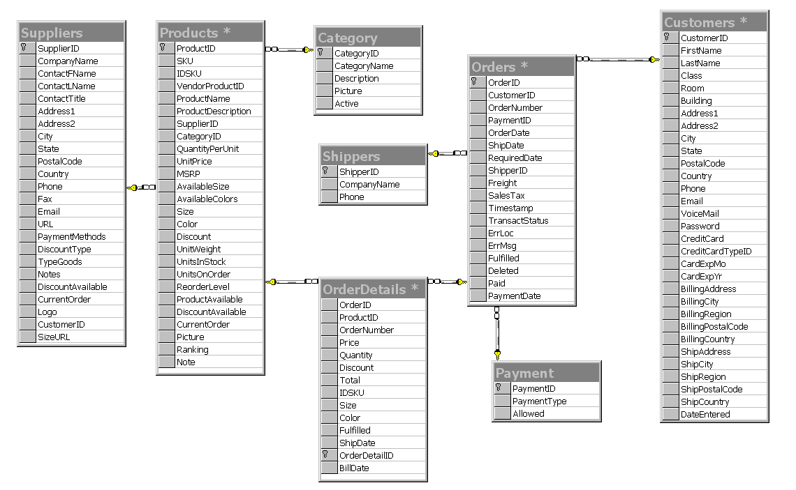

# EShop-AllModules-overview-V1
This project aims at unifying and providing all-in-one shipping, inventory management, and platform for e-commerce merchants, sellers and customers. E-commerce sellers can ship fast,access the best shipping rates, and increase orders with a suite of online tools provided by various modules of this project. Its rich features include shopping, selling and shipping integration while managing everything in one place. The web application is easy to use and has intuitive features for a great user experience. The design is highly scalable and flexible to meet the below mentioned business requirements. 

## Business requirements
### Seller side
- Register
- Login
- Dashboard
- Posted Products

### Customer side 
- Registration
  - Types
    - Regular native registration
    - Google registration with OAuth2
  - Features
    - Successful registration email

- Login
  - Google OAuth redirection
  - Forgot userid or password

- Dashboard
  - Polpular
  - Recently Viewed
  - Sugesstions

- Cart
  - Save Cart items in cookies

- Shipping 
    - Catogories
      - Regular
      - Express

- Payment gateway redirection 
    - save user details in session before redirection

- All Orders

- View Posted products
  - Categories
    - SubCategories
    - Search Filters for product categories

## Database schema:
(tentative)  

## Technologies
### Front-End
#### Overview
- JSP & Custom Tags  
- HTML 
- CSS

### Back-End
#### Overview
- Server: Tomcat
- Connector: JDBC
- Database: MySQL
- Frameworks: Spring- MVC, Security
  
### CI/CD
Jenkins

### Cloud Deployment
AWS (EC2, S3, Lambda)

### Tentative features
- AWS (Dynamo DB) for storing and retrieving products 
- Voice search support
